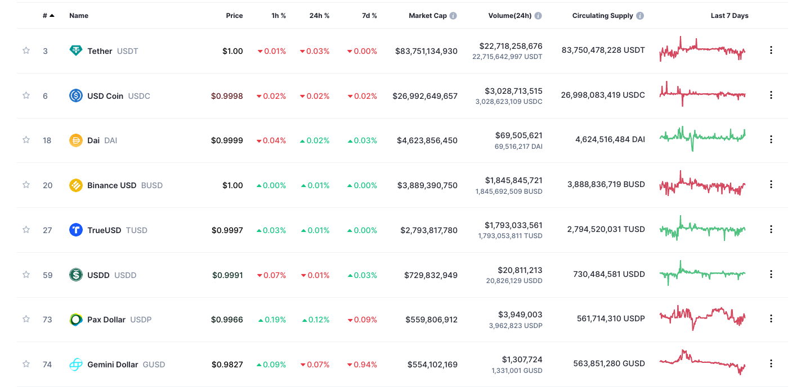
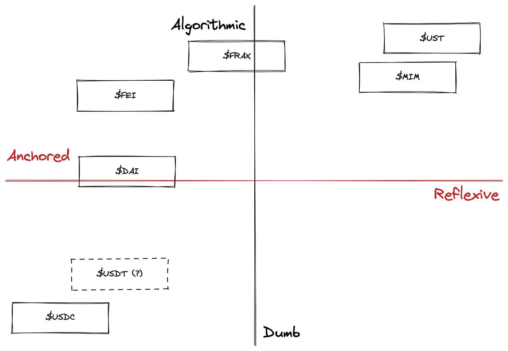
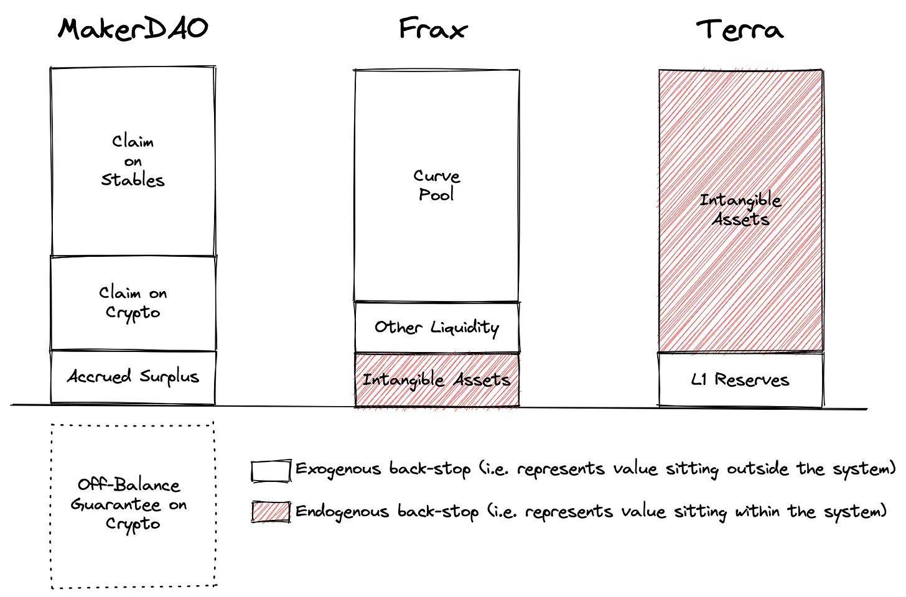
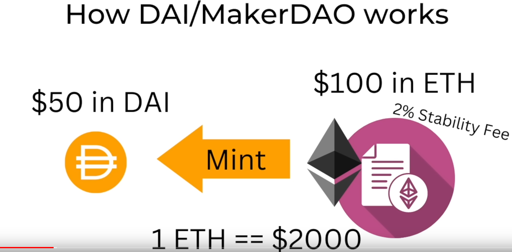
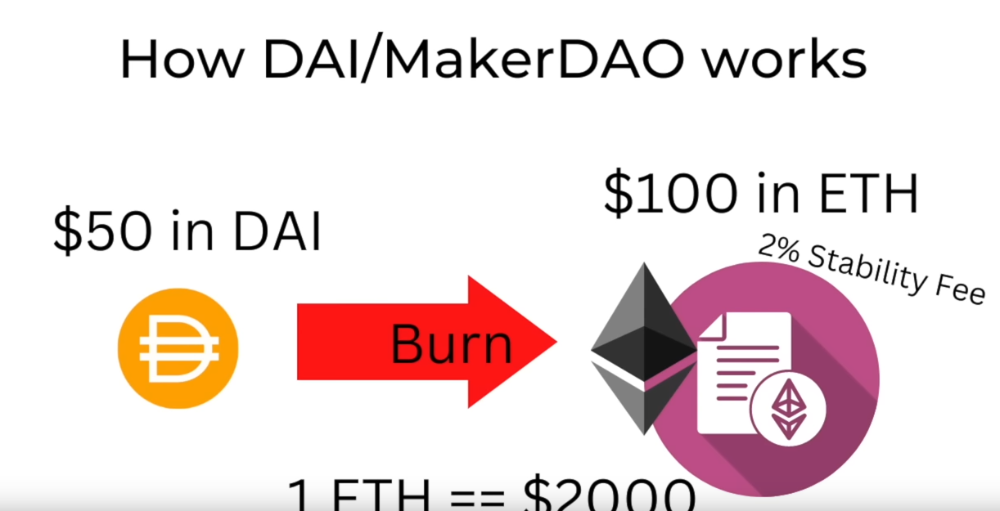
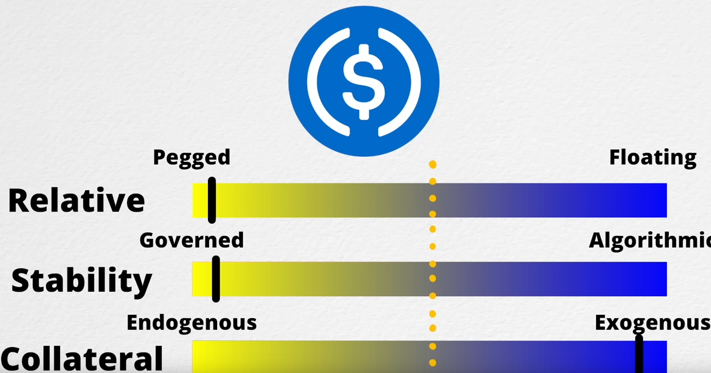
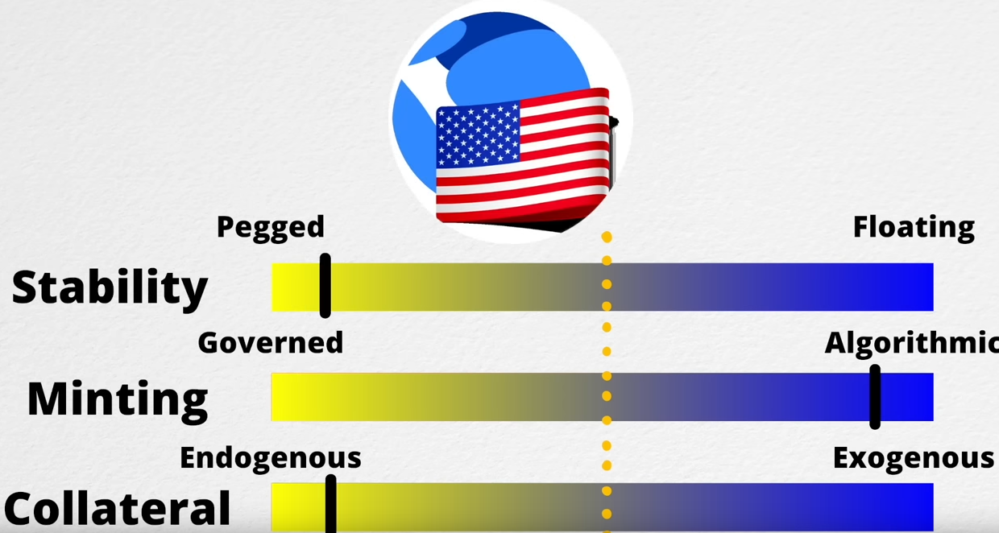

Sự ổn định - maybe? Là điều mà tất cả mọi người đều mong muốn, nhất là trong thị trường tiền điện tử. Vậy stable coin là gì? Tại sao nó lại được gọi là stable coin? Và nó có thực sự ổn định không?

Tôi còn nhớ như in sự kiện 1 năm về trước, cái thời mà một đế chế khổng lồ mang tên Terra với token LUNA và UST sụp đổ cùng với sự bốc hơi của hàng tỷ đô la. Cách nhìn của nhân loại về Stablecoin đã trở lên cẩn trọng hơn rất nhiều. Bài viết này là nền tảng để hiểu được bản chất của Stable coin, cách mà nó trở lên Stable để từ đó cảnh giác với những nguy hiểm có thể xảy ra với nó.

# Tại sao ta cần Stable coin?

## Stable là gì?

Stable currency đơn giản là lực mua và lực bán của chính nó trên thị trường tự cân bằng với nhau khiến giá nó gần như không giao động. Trong định nghĩa cơ bản mà các bài viết khác nêu ra, giá trị của nó được đảm bảo bởi một tài sản thực như đô la, vàng, dầu,.. Tuy nhiên, đây chỉ là một phần của sự thật.

Lực mua đơn giản được hiểu là giá trị của nó tại thời điểm được xem xét, ví dụ nếu dùng Bitcoin để mua táo thì lượng táo mua được tại thời điểm này sẽ khác lượng táo mua được ở 1 năm trước với cùng 1 BTC. Đây là minh chứng của sự thay đổi trong lực mua, còn nếu ta dùng dollar thì cùng lượng 10k$ ta vẫn mua được lượng táo tương tự với 1 năm về trước đây là minh chứng của lực mua cân bằng với lực bán (sự thật là trong 1 năm nay, Bitcoin có nhích giá lên cỡ 8k USD cho mỗi BTC nhưng lạm phát cũng nâng theo đặc biệt với các quốc gia châu Âu cũng không dám chắc là mua được nhiều hơn hay không). Vì thế người ta coi USD là stable trong khi Bitcoin thì không.

Stable coin là cryptocurrency có lực mua ổn định (stable) vì bản thân các cryptocurrency thông thường không hề stable.

## Tại sao cần quan tâm đến chúng?

Đơn giản thôi, bạn có đồng ý với tôi không? **Tiền** rất là quan trọng. Tiền giúp chúng ta:

- Lưu trữ giá trị. Đơn giản là thay vì giữ tiền, ta giữ táo thì theo thời gian táo sẽ héo và mất đi giá trị, còn tiền thì không.
- Đơn vị tính toán. Để tính toán giá trị của một thứ gì đó, ta cần một đơn vị chung để so sánh, và trong cuộc sống hiện nay đơn vị này gọi là tiền.
- Phương tiện thanh toán. Để trao đổi giá trị, ta cần một phương tiện thanh toán. Xài tiền, ta dễ dàng mang theo để thanh toán khi cần thiết. Xài gạch ... đúng là nó có thể dùng để trao đổi giá trị nhưng nó quá to, khó định giá trị và khó mang theo.

Vậy nên, tiền là một phần không thể thiếu trong cuộc sống của chúng ta. Và stable coin là phiên bản Crypto của tiền trong thế giới Crypto. Để thanh toán, lưu giữ giá trị ổn định và tính toán giá trị theo cách mà Crypto hoạt động.

# Xác định loại Stable coin

Có nhiều cách phân loại Stable coin được nhìn nhận tùy theo ý hiểu của mỗi người. Bản thân tôi sẽ không phân loại Stable coin theo hướng những chiếc hộp kiểu Paxos là do giá trị tiền trong ngân hàng, USDT là do cty bảo lãnh, ... Tôi dùng các xác định Stable coin theo bản chất của nó.

## Xác định 1: Điểm ổn định

Điểm ổn định là cách nhìn nhận một thứ gì đó ổn định so với thứ gì đó.

Với Stablecoin có 2 cách để ổn định:
- Pegged: Một là dựa vào việc pegged (bám giá trị vào một loại tài sản khác như dollar). Tether, DAI, USDC là minh chứng của USD pegged stable coin. Nghĩa là 1 đơn vị của mỗi đồng trên tương ứng với 1 dollar. Nó stable vì giá trị của nó đi theo một thứ mà ta coin là stable đó là USD. Những token này giữ giá bằng cam kết, ví dụ USDC nêu ra là mỗi đồng USDC được in ra là có thêm 1 USD vào trong tài khoản ngân hàng của họ. DAI thì hơi đặc biệt hơn. 
- Float: Một cách khác để ổn định đó là thả trôi. Đừng hiểu nhầm với các loại coin khác. Đơn giản là lực mua và bán của nó luôn ổn định khiến nó stable nên bằng cách nào đó, nó còn stable hơn cả những pegged stable coin. Lấy ví dụ năm nay tôi có thể mua 5 quả táo với 10$ nhưng 5 năm trước 10$ tôi có thể mua 10 quả táo, tuy nhiên nếu tôi dùng táo coin là loại stablecoin thuộc loại này thì 5 năm trước 10 táo coin tôi mua đc 10 quả táo, năm nay 10 táo coin vẫn mua được 10 quả táo và 5 năm sau với 10 táo coin vẫn mua được 10 quả táo. Loại stable coin này thực sự tồn tại ư? Đúng vậy có rất nhiều hệ sinh thái riêng biệt sử dụng stable token như một loại xu để tiêu xài trong hệ sinh thái.

Đơn giản để hiểu 2 loại trên là con tàu và mỏ neo. Khi thả neo xuống, neo sẽ nằm yên dưới đáy biển trong khi con tàu vẫn trôi nổi trên mặt nước. Trong trường hợp này neo là ổn định hay con tàu là ổn định? Sự thật là neo ổn định so với mặt đất còn tàu ổn định so với mặt biển.

## Xác định 2: Cách thức ổn định

Một stablecoin phải đảm bảo được có thứ gì đó hoạt động để nó ổn định. Sự ổn định được cần được đảm bảo để in và đốt một cách hợp lý. Đó là lý do ở đề tài này, ta quan tâm đến việc ai hay cái gì khiến nó ổn định.Ta có 2 loại theo hướng nhìn nhận này:
- Governed: Là loại stablecoin được ổn định bởi một cộng đồng. Cộng đồng này có thể là một nhóm người, một công ty, một tổ chức, ... Ví dụ như DAI được ổn định bởi MakerDAO, USDC được ổn định bởi Coinbase và Circle, ...
- Algorithmic: Là loại stablecoin được ổn định bởi một thuật toán mà không có tác động của con người. Bản thân DAI cũng có một phần ổn định bởi thuật toán. Tuy nhiên, nó vẫn có sự can thiệp của con người. Ví dụ như khi giá ETH giảm, MakerDAO sẽ tăng lãi suất để khuyến khích người dùng giữ DAI thay vì bán ra. Tuy nhiên, vẫn có một số loại stablecoin được ổn định hoàn toàn bởi thuật toán. Đại diện lớn nhất trong số đó mà cũng là ác mộng của nhiều người ... UST.

Nghe thì có vẻ Algorithmic Stablecoin thực sự rất rủi ro, đừng trách thuật toán đó là thứ thuần khiết nhất ở cách hoạt động, tham khảo thêm tại [đây](https://dirtroads.substack.com/p/-40-pruning-memes-algo-stables-are)

Đây là một hình minh hoạt trong bài viết kể trên mô tả về tính thuật toán của Stablecoin:

## Xác định 3: Mối quan hệ với công ty phát hành

Mối quan hệ với công ty phát hành giữa Stable coin và công ty chịu trách nhiệm mang lại giá trị cho nó. Lấy ví dụ USDC được backed bởi USD và hoàn toàn có thể swap trực tiếp từ 1 USDC sang 1 USD, DAI thì bằng nhiều loại tài sản lấy ví dụ có thể deposit ETH để mint DAT. Còn ... UST là đảm bảo bởi LUNA.

Để làm rõ mối quan hệ này, ta trả lời câu hỏi nếu Stablecoin đó thất bại có khiến tài sản thế chấp mất giá không? Câu trả lời là có thì Stablecoin đó thuộc loại endogenous, ngược lại là exogenous.
- Exogenous: Là loại stablecoin không ảnh hưởng đến tài sản thế chấp. Ví dụ như USDC, DAI, ...
- Endogenous: Là loại stablecoin ảnh hưởng đến tài sản thế chấp. Ví dụ như UST, ...

Đây chính là lý do chính khiến UST thất bại khi tài sản thế chấp là LUNA, loại tài sản có gá trị ảo, tạm thời cao trong mùa uptrend.

Vấn đề chính mà exogenous khó đạt được vì để có giá trị marketcap lớn như Tether cần đến khoảng 80 tỷ USD lưu trữ, một con số khó đạt được. Trong khi UST lựa chọn con đường endogenous, vốn hóa của nó từng lên top 10 coinmarketcap mà không cần bất cứ USD nào lưu trữ.

# Phân tích một vài loại Stablecoin phổ biến

## DAI

DAI là một loại stablecoin lai giữa thuật toán và đảm bảo bởi tài sản Crypto.

Khi người dùng deposit tài sản thế chấp vào MarkerDAO, người dùng sẽ in được DAI bằng với 50% giá trị của tài sản thế chấp đồng thời phải trả thêm 2% phí Stability Fee.

Bài toán đơn giản là nếu muốn nhận lại ETH đã deposit thì phải trả lại lượng DAI và thêm 2% Stability Fee. Quá trình Burn sẽ diễn ra.

Giờ giả sử bạn có DAI nhưng không buồn rút lại ETH, giá của ETH bạn nạp vô tụt 1 nửa. Quá trình thanh khoản diễn ra và toàn bộ lượng ETH bạn nạp vào không thể rút ra được nữa.

## USDC

Loại token này rất đơn giản. Đơn giản là tài khoản ngân hàng của công ty chủ quản có bao nhiêu tiền thì có bấy nhiều USDC được lưu hành.

## UST

UST là loại stablecoin được ổn định bởi thuật toán và đảm bảo bởi tài sản bao gồm USD, crypto bao gồm chính nó. Vấn đề chính của nó là bản thân là Endogenous nên khi bản thân nó ít % được đảm bảo bởi các pegged khiến nó kém hấp dẫn người dùng hold hơn. Khi người dùng không buồn hold LUNA nữa thì giá rớt làm khó hơn trong việc giữ pegged làm giảm người dùng hold làm giá rới và cứ thế UST đổ nát.

# Stablecoin nào là tốt nhất?

Câu trả lời là: Tốt nhất cho ai?

Nhiều Stable coin được đảm bảo bởi tài sản và vận hành bởi 1 tập thế uy tín như Tether, USDC hay TUSD có thể an toàn nhưng vấn đề của nó là tính tập trung và nếu đó là vấn đề thì bạn sẽ prefer hơn những loại stable coin vận hành bởi thuật toán vì nó không bị kiểm soát bởi 1 tập thể cụ thể nào.

Vấn đề của các Stable coin thuật toán là không quen thuộc với tập người dùng non-cryptocurrency sẽ mang lại nỗi sợ khi không thể dùng nó đúng cách.

Một trong những bài toán cần để sử dụng Stable coin đó là sau khi mua ETH giờ tôi muốn có nhiều ETH hơn, thế là tôi bỏ Stable coin vào MarkerDAO để có thêm DAI mua ETH.

Tóm lại: Tại sao Stablecoin tốt? Vì nó đảm bảo những yếu tố cơ bản để coi là tiền.

Tại sao người ta tạo ra Stablecoin? Để làm đòn bẩy lợi nhuận.

Ngoài ra giao dịch Stablecoin, chúng ta dùng sàn riêng chứ không xài uniswap như phổ thông. Tên nó là Curve Finance.
